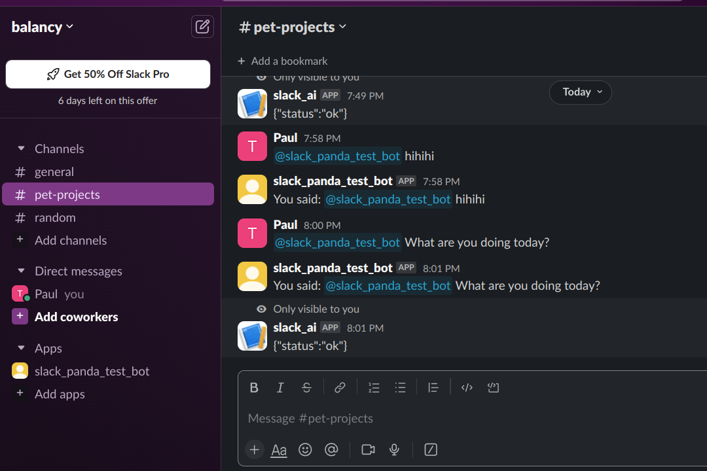

# Slack bot



The app represents the AI slack bot. It uses ChatGPT to answer in public chats if is invited or via the private messages.

## Local installation and launch

You should have at least Git and Docker installed on your system. You should also create a bot instance with correct permissions in your slack workspace.

1. Clone the git repository

```
git clone https://github.com/balancy/slack_bot.git
```

2. Copy the file with the environment variables and define them inside .env

```
cp .env.example .env
```
where
- `SLACK_SIGNING_SECRET` - your slack signing secret
- `SLACK_CLIENT_ID` - your slack app client id
- `SLACK_CLIENT_SECRET` - your slack app client secret
- `HOST` - host of your app
- `OPENAPI_API_KEY` - your openapi key
are required environment variables

AND
- `OPENAI_TEMPERATURE` - temperature for the chatgpt model
- `OPENAI_MODEL` - chatgpt model to use
- `OPENAI_MAX_TOKENS` - max tokens for chatgpt response
are optional environment variables


3. Launch the app

```
make launch
```

## Usage

You should generate the link for the bot app and share it. Slack user who opens the link and grants permission for the bot,
add it to his/her workspace. You can communicate with the bot by tagging it or via /call_panda command.